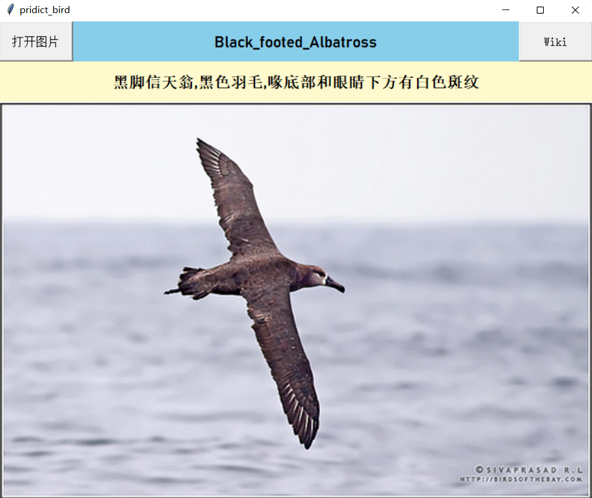

## 如何使用文件夹中的各个代码
**如果目的是依次重复我所进行过的尝试，应当按照顺序操作如下文件：**

* 运行checkSize.py，遍历数据集，了解图片尺寸（长宽均大于等于120，小于等于500），以在读入图片后正确的resize
* 运行createSmallBatch.py，其中smallBatchSize可以设置在创建小数据集时，每一类的样本数量
* 依次运行vgg16finetuneSmall.ipynb的每个单元格，代码可以拟合小训练集，没有致命问题，可以考虑在整个训练集上运行
* 依次运行vgg16finetuneBig.ipynb的每个单元格，发现泛化性不好

## 图形界面：

* 图形界面要运行GUI.py（在Classify_GUI-main文件夹中）,需要pip或conda安装pandas和openpyxl
* 点击“打开图片”，最上方会给出分类，下一行会给出简单介绍
(关于文字介绍：我们只撰写了部分鸟类的介绍以演示功能，其他鸟类介绍由于是重复性工作，可以简单完成）
* 点击右上角的“Wiki”，可以自动跳转到对应鸟类的维基百科
* 可反复上传图片
图形界面使用预训练好的模型处理输入图像，得出分类。为了pre时不预测出错，使用了与最终版本不同的模型，其在训练集和测试集同时训练，并放任过拟合达到了100%的准确率

## google Colab: 
* [res152-2.ipynb](https://drive.google.com/file/d/14tuEH0OonGIIiV3ITUx8BkkbgaTa90Kh/view?usp=sharing)依次运行每个单元格。
